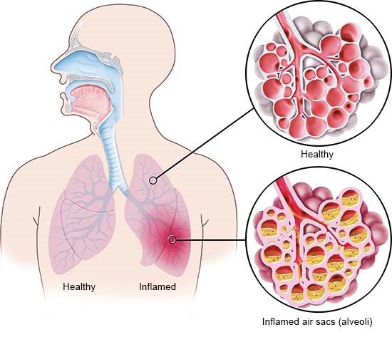

# Pneumonia detection with CNN using tensorflow/ keras

## Pneumonia (Lungenentzündung)

Pneumonia is an infection that inflames the air sacs in one or both lungs. The air sacs may fill with fluid or pus (purulent material), causing cough with phlegm or pus, fever, chills, and difficulty breathing. A variety of organisms, including bacteria, viruses and fungi, can cause pneumonia.

Pneumonia can range in seriousness from mild to life-threatening. It is most serious for infants and young children, people older than age 65, and people with health problems or weakened immune systems.

# The Dataset
Source: Kaggle

## Content
The dataset is organized into 3 folders (train, test, val) and contains subfolders for each image category (Pneumonia/Normal). There are 5,863 X-Ray images (JPEG) and 2 categories (Pneumonia/Normal).

Chest X-ray images (anterior-posterior) were selected from retrospective cohorts of pediatric patients of one to five years old from Guangzhou Women and Children’s Medical Center, Guangzhou. All chest X-ray imaging was performed as part of patients’ routine clinical care.

For the analysis of chest x-ray images, all chest radiographs were initially screened for quality control by removing all low quality or unreadable scans. The diagnoses for the images were then graded by two expert physicians before being cleared for training the AI system. In order to account for any grading errors, the evaluation set was also checked by a third expert.

Acknowledgements
Data: https://data.mendeley.com/datasets/rscbjbr9sj/2

License: CC BY 4.0

Citation: http://www.cell.com/cell/fulltext/S0092-8674(18)30154-5

# Data preprocessing
The training data proofed to be imbalanced in favor for 

# Model Training 

## First model 
In order to train the the model a basic suggestion from chatgpt was implemented first to assess the models performance.
A simple sequential model (layer-by-layer) was suggested. The model consists of 3 convolutional layers, followed by flattening to flatten the output from the convolutional layers.
The flattening process is followed by a fully conceted layer with 128 neurons and a dropout of 0.5. In order to perform a binary classification the model then was followed by an 
outputlayer with a sigmoid activation function. The optimization consits of the following settings: optimizer= "adam", loss = "binary_crossentropy", metrics= ["accuracy"]

This model was given 5216 images for the training process. The training included 10 epochs, a batch_size of 32m and the validation data.
After the completed training process, the models accuracy was assessed on the test_images. Resulting in an overall accuracy of 76.6 %

There is a certain imbalance in the test data with only 37.5 % normal cases. The data shows that the model struggles to correctly identify "normal" cases. 

## Second Model and the effect of Data augmentation
As the dataset is publicly available on kaggle, various notebooks are available in the internet.
In order to tackle the imbalance of the dataset data augmentation was proposed as a strategy to improve model generalization, prevent overfitting and 
enhance robustness to variations in real-world data.

Data augmentation is a techniques that is used artificially expand the training dataset by applying transformations to existing images.

The notebook also suggested a different setup of the convolutional neural network. In the following, the models performance without data augmentation as well as
both models performance metrics with the use of data augmentation will be assessed. 

In order to compare the two different models the same training process was followed:
This model was given 5216 images for the training process. The training included 10 epochs, a batch_size of 32m and the validation data.

The more complex model did not resulted in a significant improvement.

## Data augmentation

# Final Model Assessment

Using the less complex model...........

